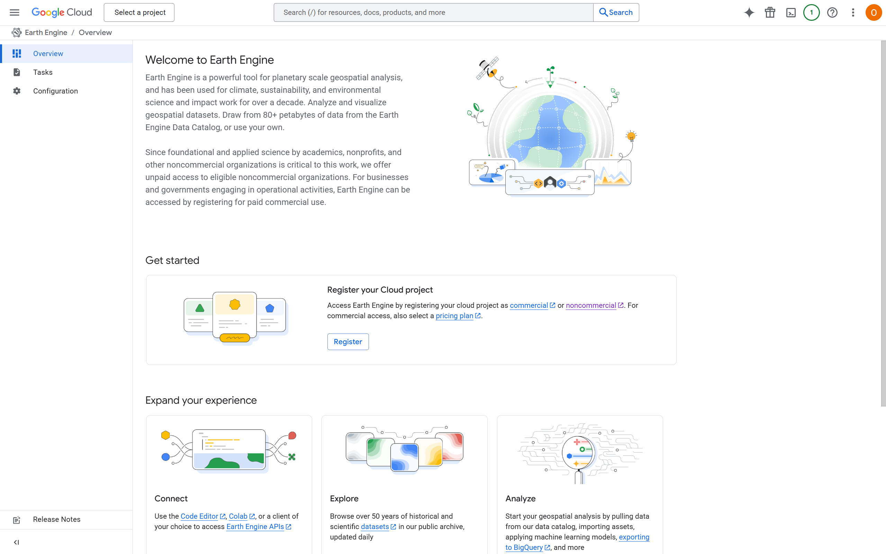
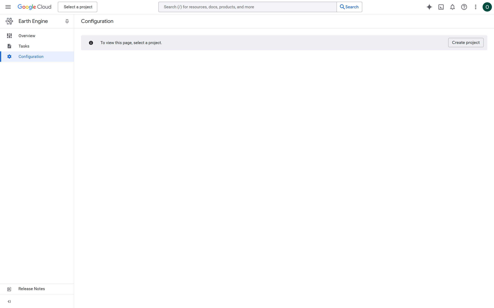
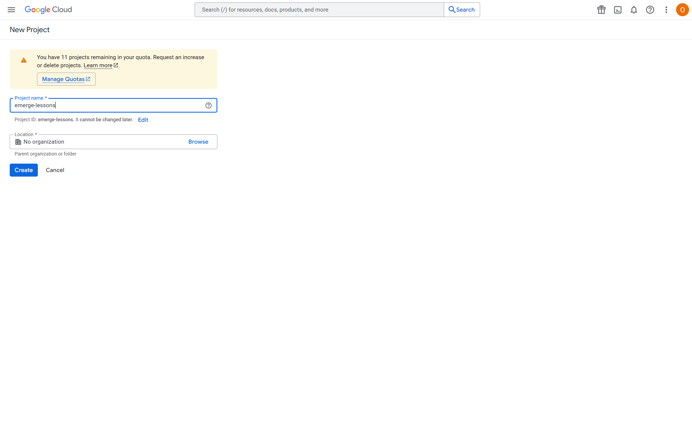
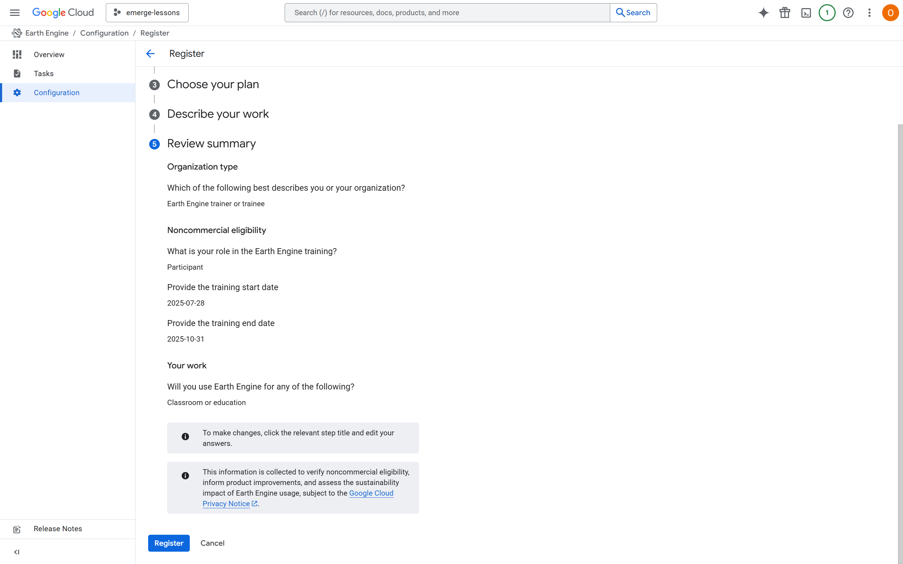

# Get Google Earth Engine

```{note}
We recommend using an `@gmail.com` address instead of an institutional .org or .edu email address. This is because Google Cloud may have different options based on your institutional email's settings. Thus, we found that Gmail may be the best for working with Google Earth Engine for educational purposes.
```

1. Go to [console.cloud.google.com](https://console.cloud.google.com/) and sign into your Google account if you're not already signed in. Click {guilabel}`Create Project`, which leads to the screen below.


2. Enter a name like "emerge-lessons" and click {guilabel}`Create`. This name is your project ID. If you are using a .edu or an organizational email, this page may look different and you may have other options or limitations.

```{important}
Make note of your project ID! There may be some numbers after what you typed, like emerge-lessons-359891
```

3. Go to [console.cloud.google.com/earth-engine](https://console.cloud.google.com/earth-engine) and click {guilabel}`Register` under "Register your Cloud project."


4. Click {guilabel}`Get started` under "See if you are eligible for noncommercial use."


5. Complete the series of short questions as follows:

> For "Select your organization type" choose "Earth Engine trainer or trainee" and click {guilabel}`Next`

> For "Check noncommercial eligibility" choose "Participant" for the first question and then write the date you are starting the lessons, as well as the date you expect to finish. If you are not sure yet, you can put "10/31/25." If you end up needing more time, you can update this. Click {guilabel}`Check eligibility`

> Click {guilabel}`Next` and it should say {fa}`circle-info` **A pricing plan is not required for noncommercial registration.**

> For "Describe your work," under "Will you use Earth Engine for any of the following? *" choose "Classroom or education" and click {guilabel}`OK`. Then click {guilabel}`Next`

> Your screen should look like below:


6. In the pop-up that appears, click {guilabel}`Enable` to enable the Earth Engine API.


7. You should now see the page below. You can now close out of these tabs.


You have now created your cloud project and enabled the API! Move to the next section to start running Google Earth Engine in Google Colab.